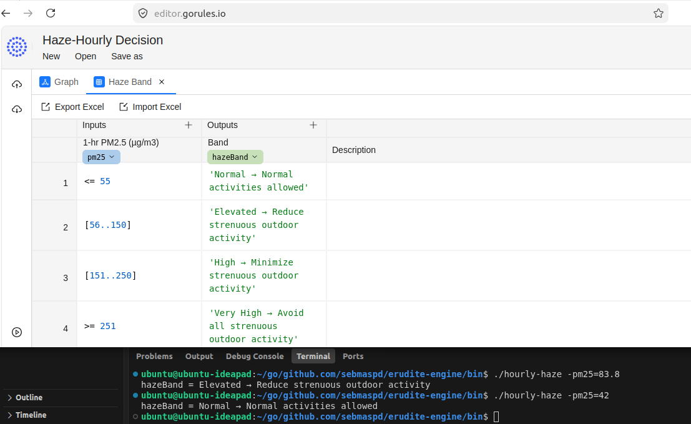
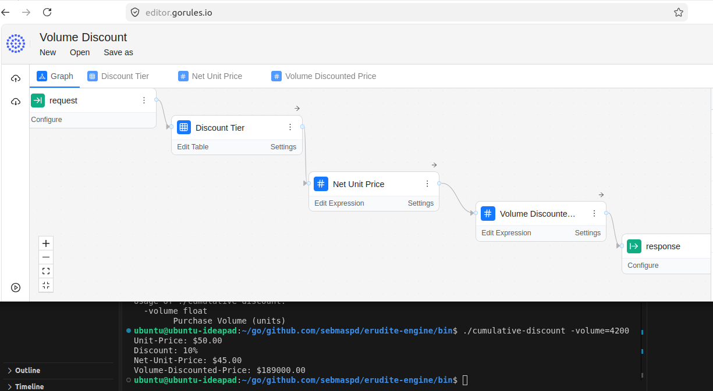

# Getting started with JDM

See:  
https://github.com/gorules/zen  

## Prompts

1. translate @dmn/add.dmn to JDM, using gorules zen package, write a Go program that accepts arguments "a" and "b" to process the "add" rule
2. similarly, do the same for @dmn/haze-hourly.dmn, save the Go program and JDM to @hourly-haze/ directory, the Go program expects an argument called pm25.
3. write Makefile to build "add" and "hourly-haze", binaries and JDM files will be saved to @/bin
4. list all previous prompts to @README.md "Prompts" section
5. based on the sample contract clause in @cumulative-discount/contract-claude.md, create a JDM and a Go program that accepts the Purchase Volume as input. The output will show the Unit-Price, Discount, Net-Unit-Price, Volume-Discounted-Price.

## JDM on-line editor

To view or modify,load the JDM json file into https://editor.gorules.io/  

### Singapore Hourly Haze Advice

### Sample Contract Clause for Volume Discount

